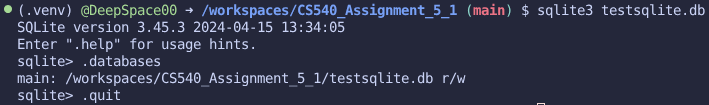
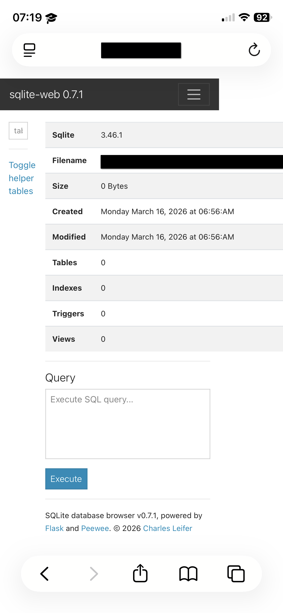
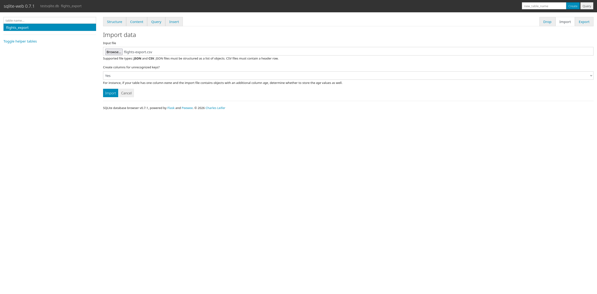
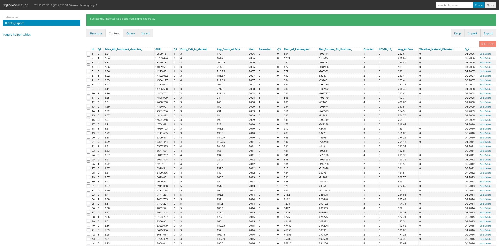
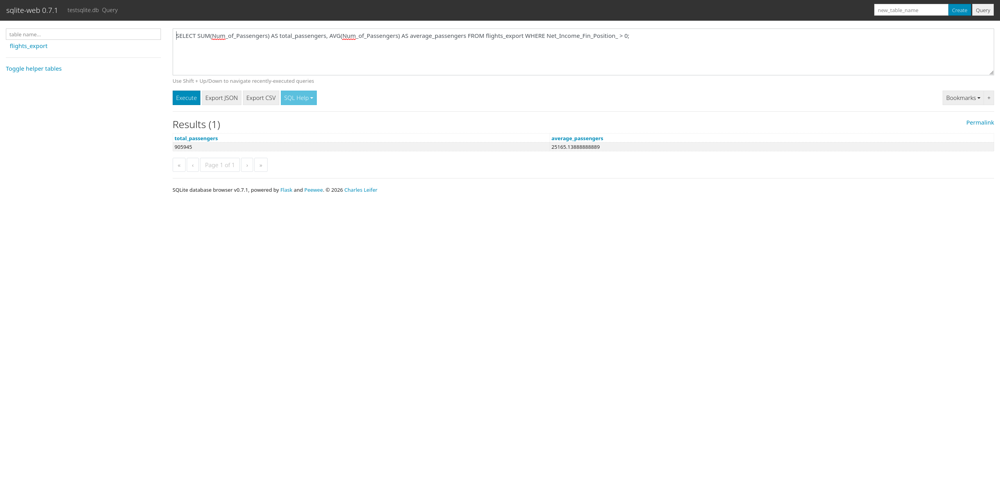
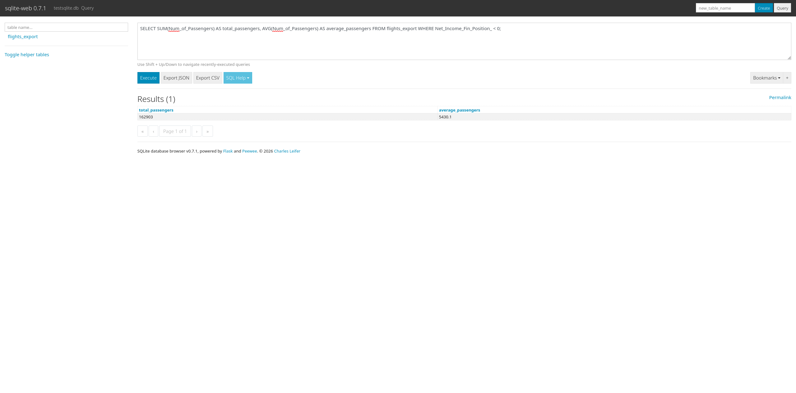
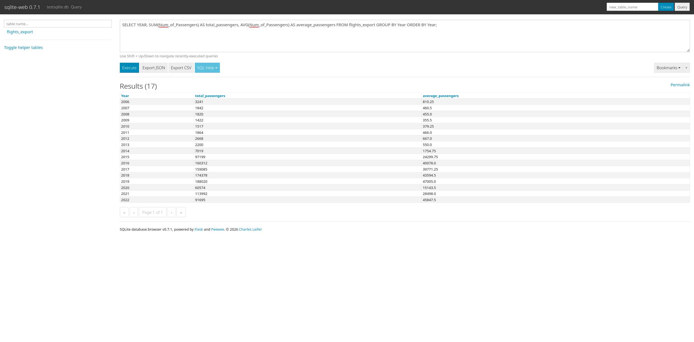
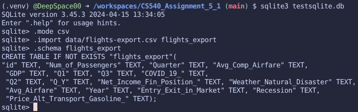
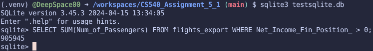

# CEC510 Assignment 5.1

1. Open an empty gitpod workspace in Github Codespace

2. Install sqlite and sqlite web

    See `scripts/sqlite_install.sh` & `.venv/lib`

3. Use command prompt of sqlite to create your first database with filename 'testsqlite.db'.

    

5. Lanuch sqlite-web with the 'testsqlite.db'. And show that you are able to visit the sqlite-web portal from your mobile phone.

    

6. Create a table and import the dataset `flights-export.csv` into testsqlite.db using sqlite-web.

    

    

7. In sqlite-web use SQL statement to finish the following queries.

    a) Calculate the total and average number of passengers per year, given that Net Income (Fin. Position) > 0.

    

    b) Calculate the total and average number of passengers per year, given that Net Income (Fin. Position) < 0.

    

    c) Calculate the total and average number of passengers per year.

    

8. Use sqlite command prompt to redo one of the queries in 7.

    

    